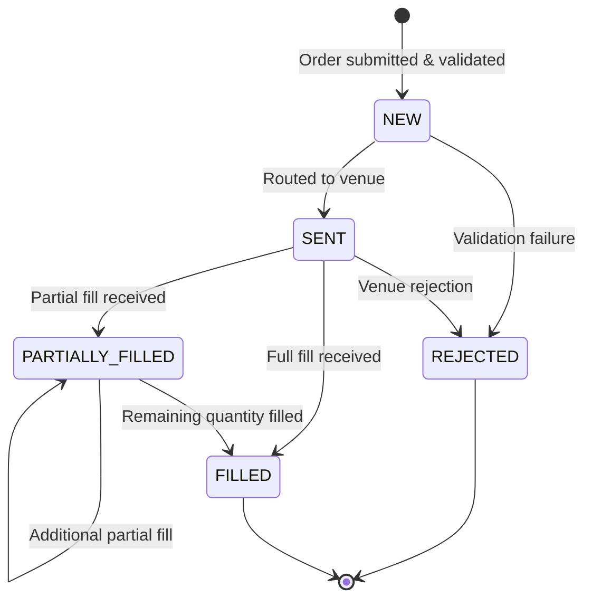

# Order Management System — Prototype

## Objective

This repository contains a lightweight prototype of a hedge fund Order Management System (OMS) built in Python. The prototype focuses on the core workflow requested in the exercise: order capture, validation, routing, simulated execution handling, post-trade reporting, and reconciliation.

The intent is to demonstrate clear system design, disciplined workflow modelling, and pragmatic implementation choices rather than to reproduce a full production OMS.

## Scope Summary

The prototype covers the following capabilities:

- Order creation through an HTTP API
- Validation of required fields and basic trading constraints
- Explicit order lifecycle management
- Simulated venue responses for fill, partial fill, and rejection outcomes
- Execution persistence and position updates
- Trade-file generation, position reporting, and reconciliation checks
- Idempotent order submission and a full audit trail

---

## Architecture & Design Choices

### Layer separation

```
┌─────────────────────────────────────────┐
│  API Layer  (FastAPI routes)            │  ← HTTP boundary, input/output serialisation
├─────────────────────────────────────────┤
│  Service Layer  (domain/service.py)     │  ← Business logic, orchestration
├─────────────────────────────────────────┤
│  Core Layer  (enums, state machine,     │  ← Pure logic, no I/O
│              validators, config)        │
├─────────────────────────────────────────┤
│  Infra Layer  (repository, DB, venue)   │  ← All I/O (SQLite reads/writes, simulation)
└─────────────────────────────────────────┘
```

Dependencies point **downward only**: the API depends on the service layer, the service layer depends on core logic and infrastructure, and the core layer is isolated from HTTP and storage concerns. This separation keeps the code easy to test and makes the workflow easier to explain.

### Technology choices

| Concern | Choice | Rationale |
|---|---|---|
| API framework | FastAPI | Automatic OpenAPI docs, Pydantic validation, async-ready |
| Database | SQLite | Zero-config for prototype; schema is identical to Postgres |
| Validation | Pydantic v2 + custom validators | Pydantic at API boundary, custom layer catches business rule violations |
| State machine | Hand-written transition table | Explicit, readable, trivially testable |
| Persistence | sqlite3 (stdlib) | No ORM overhead; SQL is transparent |
| Testing | Pytest | Industry standard; each test gets an isolated DB via `tmp_path` |

### Design rationale

The implementation deliberately favors explicitness over abstraction:

- The order state machine is hand-written so legal transitions are easy to inspect.
- The repository layer centralises all SQL access so business logic is not mixed with persistence.
- The service layer owns workflow orchestration, making the lifecycle readable from a single place.
- SQLite keeps the prototype self-contained while still allowing a realistic relational schema.

---

## Project Structure

```
OrderBookManagement/
├── app/
│   ├── main.py                  # FastAPI app, startup hooks, router mounting
│   ├── api/
│   │   ├── orders.py            # Order CRUD + send + audit trail endpoints
│   │   └── reports.py           # Trade file, position report, reconciliation endpoints
│   ├── core/
│   │   ├── config.py            # Environment-driven configuration constants
│   │   ├── enums.py             # OrderStatus, OrderSide, SimulationMode, EventType
│   │   ├── state_machine.py     # Allowed transitions table + transition() guard
│   │   └── validators.py        # Business rule validation (collects all errors at once)
│   ├── domain/
│   │   ├── models.py            # Internal Python dataclasses (no validation overhead)
│   │   ├── schemas.py           # Pydantic request/response models (API boundary only)
│   │   └── service.py           # Orchestrates: idempotency → validate → persist → simulate → process
│   ├── infra/
│   │   ├── db.py                # SQLite connection factory + init_db()
│   │   ├── repository.py        # All DB reads and writes
│   │   └── venue_simulator.py   # Deterministic mock venue (FULL_FILL, PARTIAL, REJECT, RANDOM)
│   └── reporting/
│       ├── trade_file.py        # Execution CSV for prime broker / fund admin
│       ├── position_report.py   # Net position book snapshot
│       └── reconciliation.py    # Post-trade break detection
├── tests/
│   ├── conftest.py              # Isolated per-test SQLite DB fixture
│   ├── test_validation.py       # Unit tests for all validation rules
│   ├── test_state_machine.py    # Unit tests for every legal and illegal transition
│   ├── test_order_flow.py       # Integration tests: full/partial/reject end-to-end
│   └── test_reconciliation.py  # Reconciliation pass/fail scenarios
├── requirements.txt
└── README.md
```

---

## Order Workflow & State Diagram

### Lifecycle states

| Status | Description |
|---|---|
| `NEW` | Order validated and persisted. Awaiting routing. |
| `SENT` | Order dispatched to the execution venue. |
| `PARTIALLY_FILLED` | One or more fills received; residual quantity open. |
| `FILLED` | Fully executed. Terminal state. |
| `REJECTED` | Declined by the venue or failed validation. Terminal state. |

### State diagram



### Transition rules

The transition rules are implemented in `app/core/state_machine.py` as an explicit allowlist. Any transition not in the table raises `IllegalTransitionError` immediately, which prevents silent corruption of lifecycle state.

---

## Data Model

### orders

| Column | Type | Notes |
|---|---|---|
| id | TEXT PK | UUID generated by the OMS |
| client_order_id | TEXT UNIQUE | Caller-assigned; used for idempotency |
| symbol | TEXT | Normalised to uppercase |
| side | TEXT | BUY or SELL |
| quantity | INTEGER | Requested quantity |
| price | REAL | Limit price |
| filled_quantity | INTEGER | Running total of filled shares |
| avg_fill_price | REAL | Weighted average across all fills |
| status | TEXT | Current lifecycle state |
| venue | TEXT | Target execution venue |
| rejection_reason | TEXT | Populated on rejection |
| simulate_mode | TEXT | Stored for reference |
| created_at / updated_at | TEXT | ISO-8601 UTC timestamps |

### executions

Each fill event (full or partial) produces one row.

| Column | Notes |
|---|---|
| id | UUID |
| order_id | Foreign key → orders |
| exec_quantity | Shares filled in this event |
| exec_price | Execution price (with slippage) |
| venue | Where it filled |
| liquidity_flag | T = taker (final fill), M = maker (partial) |
| cumulative_filled | Running total up to and including this fill |

### positions

Maintained live after every execution. Simple net quantity book.

| Column | Notes |
|---|---|
| symbol | PK |
| net_quantity | Positive = long, negative = short |
| avg_price | Weighted average cost (increases in same direction) |

### audit_events

Every state transition and business event is written here.

| Column | Notes |
|---|---|
| id | UUID |
| order_id | May be null for pre-creation events |
| event_type | ORDER_CREATED, ORDER_SENT, EXECUTION_RECEIVED, ORDER_REJECTED, VALIDATION_FAILED, DUPLICATE_DETECTED |
| from_status / to_status | States before and after the event |
| details | Free-text context |
| created_at | UTC timestamp |

---

## Extra Features

### 1 — Idempotent order submission

Submitting two requests with the same `client_order_id` returns the original order without creating a duplicate. The first submission returns `201 Created`; any duplicate idempotent submission returns `200 OK` with the existing order. A `DUPLICATE_DETECTED` audit event is also written so the retry is visible operationally.

### 2 — Full audit trail

Every lifecycle event is persisted to `audit_events`. The `GET /orders/{order_id}/events` endpoint exposes the complete timeline for any order. In production, this is important for:
- Compliance and regulatory reporting
- Operations debugging ("why is this order stuck?")
- Client dispute resolution

---

## Post-Trade Reporting

### Trade file (`POST /reports/trade-file`)

Exports all execution records to a timestamped CSV. Each row is one execution event. Columns include execution ID, order ID, client order ID, symbol, side, executed quantity, price, notional value, venue, liquidity flag, and timestamp.

In a production setting, this file would typically be transformed into the specific format required by the prime broker or administrator, encrypted, and transmitted over a secure channel such as SFTP or FIX drop copy.

### Position report (`GET /reports/positions`)

Returns the live net position book. For each symbol: net quantity, direction (LONG/SHORT/FLAT), average cost, and indicative notional. In production the notional would use last-trade market price from a real-time data feed.

This report is used by:
- The fund administrator for daily NAV calculation
- The risk team for exposure monitoring and limits
- The prime broker for margin calculations

### Reconciliation (`POST /reports/reconcile`)

Two checks run against every FILLED or PARTIALLY_FILLED order:

1. **filled_quantity vs executions**: confirms that `orders.filled_quantity` equals the sum of `executions.exec_quantity` for that order. A mismatch indicates a data integrity bug.
2. **FILLED status vs full quantity**: confirms that a FILLED order has `filled_quantity == quantity`. A FILLED order with a residual is an unacceptable break.

The endpoint returns an overall PASS/FAIL verdict plus a per-order breakdown. In production, this control would typically be extended to reconcile against external broker confirms, custodian records, settlement files, commissions, and fees.

---

## How to Run

### Prerequisites
- Python 3.11+

### Installation

```bash
cd "OrderBookManagement"
python -m venv venv
source venv/bin/activate          # Windows: venv\Scripts\activate
pip install -r requirements.txt
```

### Start the server

```bash
uvicorn app.main:app --reload
```

The server starts on `http://localhost:8000`.
Interactive API docs: `http://localhost:8000/docs`

### Run tests

```bash
pytest tests/ -v
```

---

## API Quick Reference

```
GET  /health                            Liveness check

POST /orders/                           Create an order
GET  /orders/                           List all orders
GET  /orders/{id}                       Get one order
POST /orders/{id}/send?simulate_mode=X  Route to venue (modes: FULL_FILL, PARTIAL_THEN_FILL, REJECT, RANDOM)
GET  /orders/{id}/events                Audit trail for an order
GET  /orders/{id}/executions            Execution fills for an order

POST /reports/trade-file                Download execution CSV
GET  /reports/positions                 Current position book
POST /reports/reconcile                 Run reconciliation checks
```

## Example Workflow

At a high level, the intended sequence is:

1. Submit an order through `POST /orders/`
2. Route the order with `POST /orders/{id}/send`
3. Inspect lifecycle and execution history through the order and event endpoints
4. Review resulting positions
5. Generate trade files and run reconciliation checks

### Sample workflow (curl)

```bash
# 1. Create a valid order
curl -s -X POST http://localhost:8000/orders/ \
  -H "Content-Type: application/json" \
  -d '{"client_order_id":"demo-001","symbol":"AAPL","side":"BUY","quantity":100,"price":185.50}' | python3 -m json.tool

# 2. Send it with partial fill simulation (copy the id from step 1)
curl -s -X POST "http://localhost:8000/orders/<ORDER_ID>/send?simulate_mode=PARTIAL_THEN_FILL" | python3 -m json.tool

# 3. View audit trail
curl -s http://localhost:8000/orders/<ORDER_ID>/events | python3 -m json.tool

# 4. View position book
curl -s http://localhost:8000/reports/positions | python3 -m json.tool

# 5. Run reconciliation
curl -s -X POST http://localhost:8000/reports/reconcile | python3 -m json.tool

# 6. Test idempotency — re-submit the same client_order_id
curl -s -X POST http://localhost:8000/orders/ \
  -H "Content-Type: application/json" \
  -d '{"client_order_id":"demo-001","symbol":"AAPL","side":"BUY","quantity":100,"price":185.50}' | python3 -m json.tool

# 7. Test validation error
curl -s -X POST http://localhost:8000/orders/ \
  -H "Content-Type: application/json" \
  -d '{"client_order_id":"bad-001","symbol":"123invalid","side":"HOLD","quantity":-5,"price":0}' | python3 -m json.tool
```

### Demo script

Use this sequence for a short live walkthrough in front of reviewers.

1. Start the server.

```bash
uvicorn app.main:app --reload
```

2. Create a clean demo order.

```bash
curl -s -X POST http://localhost:8000/orders/ \
  -H "Content-Type: application/json" \
  -d '{"client_order_id":"demo-001","symbol":"AAPL","side":"BUY","quantity":100,"price":185.50}' | python3 -m json.tool
```

Expected talking point:
The order is accepted, persisted, and enters the `NEW` state.

3. Route it with partial-fill behavior.

```bash
curl -s -X POST "http://localhost:8000/orders/<ORDER_ID>/send?simulate_mode=PARTIAL_THEN_FILL" | python3 -m json.tool
```

Expected talking point:
The simulated venue emits two executions, so the lifecycle progresses `NEW -> SENT -> PARTIALLY_FILLED -> FILLED`.

4. Show the audit trail.

```bash
curl -s http://localhost:8000/orders/<ORDER_ID>/events | python3 -m json.tool
```

Expected talking point:
Each lifecycle event is captured in the audit trail, supporting operational transparency and compliance review.

5. Show the resulting position book.

```bash
curl -s http://localhost:8000/reports/positions | python3 -m json.tool
```

Expected talking point:
Each execution updates the internal position book for the relevant symbol.

6. Run reconciliation.

```bash
curl -s -X POST http://localhost:8000/reports/reconcile | python3 -m json.tool
```

Expected talking point:
The reconciliation output confirms that stored execution totals match the order-level fill totals.

7. Demonstrate idempotency by submitting the same client order ID again.

```bash
curl -s -X POST http://localhost:8000/orders/ \
  -H "Content-Type: application/json" \
  -d '{"client_order_id":"demo-001","symbol":"AAPL","side":"BUY","quantity":100,"price":185.50}' | python3 -m json.tool
```

Expected talking point:
The API returns the existing order with `200 OK` rather than creating a duplicate order.

8. Demonstrate validation failure.

```bash
curl -s -X POST http://localhost:8000/orders/ \
  -H "Content-Type: application/json" \
  -d '{"client_order_id":"bad-001","symbol":"123invalid","side":"BUY","quantity":100,"price":0}' | python3 -m json.tool
```

Expected talking point:
Invalid input is rejected at the API boundary before it can enter the workflow.

9. Generate the trade file.

```bash
curl -OJ -X POST http://localhost:8000/reports/trade-file
```

Expected talking point:
The generated CSV represents the prototype form of a downstream trade file consumed by a prime broker or fund administrator.

---

## How This Scales to Production

| Concern | Prototype approach | Production approach |
|---|---|---|
| Storage | SQLite file | PostgreSQL with connection pooling (asyncpg / PgBouncer) |
| Concurrency | Single process | Async FastAPI workers + Gunicorn, horizontal pod scaling |
| Venue connectivity | Deterministic mock function | FIX gateway (QuickFIX/J), REST broker APIs, or message queue consumers |
| Execution events | Synchronous in-process loop | Async event bus (Kafka, RabbitMQ) — decoupled producer/consumer |
| Position accounting | Simple netting | Tax lot accounting (FIFO/LIFO/SpecID), multi-currency, corporate actions |
| Risk checks | Notional cap in validator | Real-time pre-trade risk engine (position limits, concentration, VaR) |
| Reconciliation | On-demand via API | Scheduled daily job with automatic break escalation workflow |
| Auth | None | OAuth2 / JWT with role-based access control |
| Observability | None | Structured logging (structlog), distributed tracing (OpenTelemetry), metrics (Prometheus) |
| Resilience | None | Retry with exponential backoff, circuit breaker around venue APIs |
| Deployment | Local uvicorn | Containerised (Docker), deployed to Kubernetes (AKS/EKS) |

## Production Extension Path

If this prototype were extended into a fuller OMS service, the next priorities would be:

- Real venue integration through FIX or broker APIs
- Authentication, authorisation, and user-level auditability
- Cancel and amend flows
- Stronger pre-trade risk controls
- Multi-currency and fee handling
- Scheduled end-of-day reporting and reconciliation jobs

---

## Known Limitations

- No real market connectivity; all venue responses are simulated
- No authentication or authorisation layer
- SQLite is used for convenience and is not intended for concurrent production workloads
- Position accounting uses simplified netting rather than full tax-lot logic
- Cancel and amend workflows are intentionally out of scope
- Position notionals use average fill price as a placeholder because market data is not integrated
- The model assumes a single-currency environment and does not include commissions or fees
